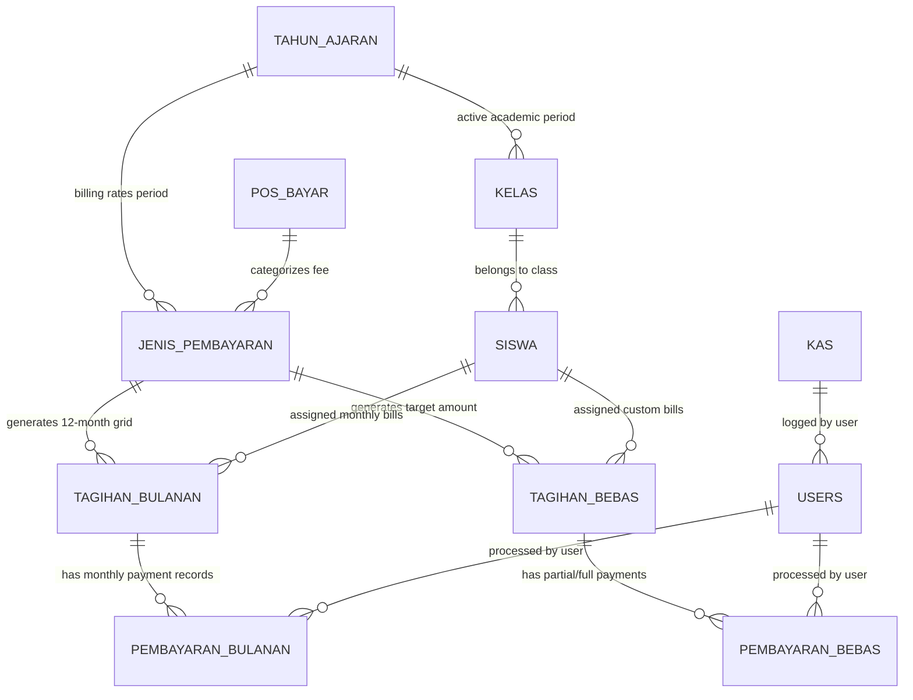

# Product Requirement Document (PRD)
## Rewrite Application: SISMA (Sistem Informasi SPP & Keuangan Sekolah)

**Version:** 2.0.0  
**Target Application:** SMA Swasta Persiapan Stabat (SPP Management System)  
**Document Status:** Final Specification  
**Goal:** Complete UI/UX Modernization & Architecture Upgrade with 100% Functional Parity  

---

## 1. Executive Summary & Project Overview

### 1.1 Background & Purpose
**SISMA** is a specialized school financial management system currently operating for **SMA Swasta Persiapan Stabat**. The legacy application is built using PHP 5/7 with an AdminLTE 2 user interface. While fully functional in handling student tuition (SPP), non-recurring fees (*Bebas*), cash journals, and reports, the legacy UI is outdated, non-responsive on modern mobile devices, lacks real-time interactive capabilities, and relies on legacy synchronous page reloads.

The objective of this rewrite project is to **completely modernize the user interface and tech stack** to a state-of-the-art web application while maintaining **strict 100% functional parity** with the existing production system. No existing business rules, billing logics, reporting calculations, or data structures will be broken or lost.

### 1.2 Core Objectives
1. **100% Functional Parity:** Retain every feature, calculation logic, report format, payment type, and configuration option present in the current production environment (`https://spp-smapersiapan.web.id/`).
2. **Modern UI/UX Experience:** Implement a premium, high-density dashboard with clean typography, dynamic color-coded payment grids, responsive drawer panels, toast notifications, keyboard shortcuts (`Cmd/Ctrl + K` student search), and dark/light mode support.
3. **Enhanced Performance:** Replace full-page browser reloads with fast client-side navigation, instant search autocompletion, real-time modal receipts, and server-side pagination.
4. **Clean Architecture:** Decouple the backend API and frontend client, utilizing modern security standards (Bcrypt password hashing, SQL injection protection, CSRF protection, and environment variable secrets management).

### 1.3 User Personas & Roles
*   **System Administrator (Admin):** Full control over master data (Students, Classes, Academic Years, Users), fee structure configuration, system identity, and database backups.
*   **School Treasurer (Bendahara):** Daily transaction counter operator responsible for collecting student SPP/fee payments, entering expense journals, generating daily financial recaps, and printing student payment slips.
*   **Student / Parent (Siswa / Wali Siswa):** Read-only portal view to check unpaid tuition balances, view payment history across 12 months, download digital receipts, and pay online via payment gateway.

---

## 2. System Architecture & Data Schema Mapping

### 2.1 Entity Relationship & Data Model (As-Is vs To-Be)

The application revolves around 10 primary domain entities:



### 2.2 Core Database Schema Specifications

1.  **`tahun_ajaran` (Academic Years):**
    *   `id_tahun_ajaran` (PK, Auto), `tahun_ajaran` (VARCHAR 10, e.g., "2026/2027"), `status` (ENUM: 'AKTIF', 'TIDAK AKTIF').
2.  **`kelas` (Class Cohorts):**
    *   `id_kelas` (PK, Auto), `nama_kelas` (VARCHAR 50, e.g., "X IPA 1", "XI SAINTEK I"), `keterangan` (TEXT).
3.  **`siswa` (Student Master):**
    *   `id_siswa` (PK, Auto), `nis` (VARCHAR 20, Unique), `nisn` (VARCHAR 20), `nama_siswa` (VARCHAR 100), `jenis_kelamin` (ENUM: 'L', 'P'), `id_kelas` (FK), `hp_siswa` (VARCHAR 20), `hp_ortu` (VARCHAR 20), `status_siswa` (ENUM: 'AKTIF', 'LULUS', 'PINDAH', 'ALUMNI'), `foto` (VARCHAR 255).
4.  **`users` / `admin` (Authentication & Roles):**
    *   `id_user` (PK, Auto), `username` (VARCHAR 50, Unique), `password` (VARCHAR 255), `nama_lengkap` (VARCHAR 100), `level` (ENUM: 'admin', 'bendahara'), `id_tahun_ajaran` (FK session).
5.  **`pos_bayar` (Fee Categories):**
    *   `id_pos_bayar` (PK, Auto), `nama_pos_bayar` (VARCHAR 100, e.g., "SPP", "Uang Pembangunan", "Seragam"), `keterangan` (TEXT).
6.  **`jenis_pembayaran` (Fee Type Configuration):**
    *   `id_jenis_pembayaran` (PK, Auto), `id_pos_bayar` (FK), `id_tahun_ajaran` (FK), `tipe_bayar` (ENUM: 'bulanan', 'bebas').
7.  **`tagihan_bulanan` (12-Month SPP Tariff Matrix):**
    *   `id_tagihan_bulanan` (PK, Auto), `id_jenis_pembayaran` (FK), `id_siswa` (FK), `bulan` (ENUM: 'Juli', 'Agustus', ..., 'Juni'), `tarif` (DECIMAL 12,2), `status_bayar` (ENUM: 'Belum Bayar', 'Lunas').
8.  **`pembayaran_bulanan` (Monthly Payment Audit Trail):**
    *   `id_pembayaran_bulanan` (PK, Auto), `id_tagihan_bulanan` (FK), `tgl_bayar` (DATETIME), `jumlah_bayar` (DECIMAL 12,2), `id_user` (FK), `no_ref` (VARCHAR 50).
9.  **`tagihan_bebas` & `pembayaran_bebas` (Non-recurring Flexible Fees):**
    *   `id_tagihan_bebas`: `total_tagihan` (DECIMAL), `terbayar` (DECIMAL), `status_bayar` (ENUM: 'Belum Lunas', 'Lunas').
    *   `id_pembayaran_bebas`: `id_tagihan_bebas` (FK), `tgl_bayar` (DATETIME), `jumlah_bayar` (DECIMAL), `keterangan` (TEXT), `id_user` (FK).
10. **`kas` (Cash Flow & General Expense Journal):**
    *   `id_kas` (PK, Auto), `tgl` (DATETIME), `uraian` (TEXT), `pemasukan` (DECIMAL), `pengeluaran` (DECIMAL), `jenis` (ENUM: 'masuk', 'keluar'), `id_user` (FK).

---

## 3. Detailed Functional Requirements & Module Specifications

### Module 1: Authentication, RBAC & Multi-Tenant Context
*   **FR-1.1 Secure Authentication:** Login screen with username, password, and session persistent state. Supports password change for active user profile.
*   **FR-1.2 Role-Based Access Control (RBAC):**
    *   *Admin Role:* Full access to Master Data, Fee Tariff Setting, Cash Book, Reports, School Identity, User Management, and System Tools.
    *   *Bendahara Role:* Access restricted to Payment Counter (Pembayaran Siswa), Expense Input (Pengeluaran), Daily Cash Summary, and Printing Receipts.
    *   *Siswa Role:* NIS-based access to personal tuition status grid, payment history, and online checkout button.
*   **FR-1.3 Academic Year Context Switcher:** Header dropdown allowing administrators and treasurers to switch active view context between different Academic Years (e.g., `2026/2027` vs `2025/2026`).

---

### Module 2: Dashboard & Executive Financial Analytics
*   **FR-2.1 Financial KPI Cards:**
    1.  *Total Active Students* (Total Siswa Aktif)
    2.  *Total Active Classes* (Total Kelas)
    3.  *Today's Payment Income* (Total Pemasukan Pembayaran Hari Ini)
    4.  *Today's Expenses* (Total Pengeluaran Hari Ini)
    5.  *Total Net Cash Balance* (Total Saldo Kas Utama)
*   **FR-2.2 Quick Action Panel:** Direct shortcuts for *Input Pembayaran Siswa*, *Tambah Pengeluaran*, *Cetak Rekap Harian*, and *Export Laporan*.
*   **FR-2.3 Recent Transactions Feed:** Real-time stream of the last 10 payment receipts processed across the system.

---

### Module 3: Master Data Management

#### 3.1 Academic Years (Tahun Ajaran)
*   **FR-3.1.1 List & Management:** Datatable displaying all academic years with active/inactive badges.
*   **FR-3.1.2 Activation Logic:** Only ONE academic year can be active at a time. Setting a new year to "AKTIF" automatically deactivates the previous year.

#### 3.2 Classes (Data Kelas)
*   **FR-3.2.1 Class Management:** CRUD operations for class cohorts (e.g., `X IPA 1`, `XI SAINTEK I`, `XII IPS 2`).
*   **FR-3.2.2 Student Count Indicator:** Show total enrolled students per class badge.

#### 3.3 Students (Data Siswa)
*   **FR-3.3.1 Student Directory:** High-density datatable with filter by Class, Status (*Aktif*, *Lulus*, *Pindah*), and live text search (*NIS*, *NISN*, *Nama Siswa*).
*   **FR-3.3.2 Student CRUD:** Complete student profile editing including NIS, NISN, Full Name, Gender, Class assignment, Parent WhatsApp phone numbers (`hp_ortu`), and profile photo upload.
*   **FR-3.3.3 Excel Batch Import:**
    *   Downloadable standard Excel import template (`.xlsx`).
    *   Drag-and-drop file upload with validation preview (detecting duplicate NIS before committing to database).
*   **FR-3.3.4 Batch Class Promotion (Kenaikan Kelas):**
    *   Select source class (e.g., `X IPA 1`) and target class (e.g., `XI IPA 1`).
    *   Select all / individual student checkboxes to execute bulk class transfer.
*   **FR-3.3.5 Batch Graduation (Kelulusan Siswa):**
    *   Select graduating class (e.g., `XII IPS 1`) and update student status to `ALUMNI` / `LULUS` in bulk.

#### 3.4 User Management (Data Pengguna / Admin)
*   **FR-3.4.1 Admin/Treasurer Accounts:** Create, edit, activate/deactivate user credentials, reset passwords, and assign roles (`admin` vs `bendahara`).

---

### Module 4: Fee Structure & Tariff Configuration (Keuangan & Setting Tarif)

#### 4.1 Pos Bayar (Fee Categories)
*   **FR-4.1.1 Category Definitions:** Manage fee master headers (e.g., `SPP`, `Uang Pembangunan`, `Uang Ujian`, `Seragam`, `Pramuka`).

#### 4.2 Jenis Pembayaran (Fee Types)
*   **FR-4.2.1 Fee Type Mapping:** Link a *Pos Bayar* to an *Academic Year* and define its type:
    1.  **Bulanan (Monthly):** Recurring fee payable every month (12 months per academic year: July, August, September, October, November, December, January, February, March, April, May, June).
    2.  **Bebas (Non-recurring / Flexible):** Total fixed fee (e.g., Rp 1,500,000 for Building Fee) that can be paid in flexible partial installments at any time.

#### 4.3 Setting Tarif Pembayaran (Tariff Rate Assignment Matrix)
*   **FR-4.3.1 Same Rate Per Class (Tarif Sama Per Kelas):** Bulk assign tariff rate to all students in a selected class (e.g., set SPP rate for `XI SAINTEK I` = Rp 125,000 / month for all 12 months).
*   **FR-4.3.2 Custom Rate Per Student (Tarif Khusus / Diskon Siswa):** Assign individual custom rates for specific scholarship or discounted students (e.g., Student A gets SPP rate Rp 75,000 / month).
*   **FR-4.3.3 Automatic Bill Generation:** Upon saving tariff assignment, the system automatically creates the corresponding `tagihan_bulanan` (12 month entries per student) or `tagihan_bebas` records.

---

### Module 5: Student Payment Transaction Counter (Pembayaran Siswa)

This module represents the core operational screen used by treasurers.

```
+-----------------------------------------------------------------------------------+
| STUDENT PROFILE BAR: [NIS: 14813] ABDUL RAHIM | Class: XI SAINTEK I | Status: AKTIF |
+-----------------------------------------------------------------------------------+
| TAB 1: TAGIHAN BULANAN (SPP 12-Month Matrix)                                      |
| +-----------+------------+------------+------------+------------+---------------+ |
| | Juli      | Agustus    | September  | Oktober    | November   | Desember      | |
| | Rp 125.00 | Rp 125.000 | Rp 125.000 | Rp 125.000 | Rp 125.000 | Rp 125.000    | |
| | [LUNAS]   | [LUNAS]    | [BAYAR]    | [BAYAR]    | [BAYAR]    | [BAYAR]       | |
| +-----------+------------+------------+------------+------------+---------------+ |
| | Januari   | Februari   | Maret      | April      | Mei        | Juni          | |
| | Rp 125.00 | Rp 125.000 | Rp 125.000 | Rp 125.000 | Rp 125.000 | Rp 125.000    | |
| | [BAYAR]   | [BAYAR]    | [BAYAR]    | [BAYAR]    | [BAYAR]    | [BAYAR]       | |
| +-----------+------------+------------+------------+------------+---------------+ |
+-----------------------------------------------------------------------------------+
| TAB 2: TAGIHAN BEBAS (Building / Uniform Fees)                                    |
| Pos Bayar: Uang Pembangunan | Total: Rp 1.500.000 | Paid: Rp 500.000 | Remaining: 1M|
| [ + Input Pembayaran Partial ]  [ Lihat Riwayat Cicilan ]                          |
+-----------------------------------------------------------------------------------+
| QUICK BUTTONS: [ Cetak Slip Hari Ini ] [ Kirim WhatsApp Receipt ]                 |
+-----------------------------------------------------------------------------------+
```

*   **FR-5.1 Instant Student Lookup:** Single search input with autocomplete supporting NIS, NISN, or Student Name.
*   **FR-5.2 Student Profile Header:** Displays Student Name, NIS, NISN, Class, Academic Year, and total accumulated unpaid balance.
*   **FR-5.3 Monthly Tuition 12-Month Grid (Tagihan Bulanan):**
    *   12-month calendar cards (July through June).
    *   Color-coded status badges: `LUNAS` (Green with payment date & receipt no), `BELUM BAYAR` (Red / Light Orange button).
    *   **Single / Multi-Month Payment Selection:** Click individual month or select multiple consecutive months to pay in one transaction.
    *   **Instant Undo / Cancellation:** Admin/Treasurer can cancel a payment entry with confirmation modal, reverting month status back to `BELUM BAYAR` and reversing cash entries.
*   **FR-5.4 Flexible Fee Installment Panel (Tagihan Bebas):**
    *   ProgressBar showing total fee, total paid amount, and remaining balance.
    *   Installment modal: Enter arbitrary partial amount (e.g., pay Rp 250,000 out of Rp 1,500,000).
    *   Payment log table showing date, amount, description, collector name, and receipt reprint button.
*   **FR-5.5 Payment Receipt Printing (Kwitansi / Slip Pembayaran):**
    *   Print single item slip or print combined daily receipt for all transactions made by a student today.
    *   Print formats: Thermal receipt (80mm/58mm pos printer) and standard A4 / Letter half-page slip.
*   **FR-5.6 Automatic WhatsApp Notification Trigger:**
    *   Upon successful payment, automatically queue a WhatsApp receipt message to the parent's phone number (`hp_ortu`):
      > *"Terima kasih, pembayaran SPP bulan September 2026 a.n ABDUL RAHIM (XI SAINTEK I) sebesar Rp 125.000 telah diterima pada 05/08/2026. No. Ref: SYR-20260805001."*

---

### Module 6: Cash Flow & Expense Journal (Kas & Pengeluaran)

*   **FR-6.1 Expense Journal Entry (Tambah Pengeluaran):**
    *   Entry Form: Date, Pos Category/Account, Description, Amount.
    *   Dynamic Multi-Row Input: Add multiple expense items in a single submission (e.g., Row 1: Pembelian Alat Tulis Rp 150.000, Row 2: Biaya Listrik Rp 450.000).
*   **FR-6.2 Non-Tuition Cash Income (Kas Masuk):** Record operational income outside student tuition payments.
*   **FR-6.3 Cash Flow Ledger (Buku Kas Umum):** Comprehensive datatable listing all incoming payments and outgoing expenses with running balance calculation.

---

### Module 7: Reports, Analytics & Exports (Laporan)

*   **FR-7.1 Laporan Pembayaran Per Kelas (Class Payment Report):**
    *   Filters: Academic Year, Class, Fee Type (*Bulanan* / *Bebas*).
    *   Matrix Table: List of all students in class vs 12 months, displaying payment dates for paid months and `v` / `x` indicators.
*   **FR-7.2 Laporan Tagihan Siswa / Tunggakan (Unpaid Balance Report):**
    *   Filters: Class, Academic Year, Minimum Months Unpaid.
    *   Generates student arrears list with breakdown of unpaid months and total money owed.
    *   Bulk WhatsApp Billing Reminder trigger for all parents in the arrears report.
*   **FR-7.3 Rekapitulasi Pembayaran Harian & Per Periode (Daily / Period Financial Recap):**
    *   Filters: Start Date, End Date, Payment Collector (User).
    *   Summary breakdown of income by Pos Bayar (SPP, Gedung, Seragam) + Expenses = Net Cash Collected.
*   **FR-7.4 Laporan Rekapitulasi Kondisi Keuangan (Financial Balance Sheet):** Overall cash balance report comparing total overall income vs expenses per month.
*   **FR-7.5 Multi-Format Exporting:**
    *   Excel (`.xlsx` formatted spreadsheets with proper headers and table styles).
    *   PDF (Clean print layout formatted with school letterhead / Kop Surat).

---

### Module 8: System Settings & Integrations (Pengaturan & Integrasi)

*   **FR-8.1 School Identity Configuration (Pengaturan Identitas):**
    *   School Name (SMA Swasta Persiapan Stabat), N地に / NPSN, Full Address, Contact Phone, Email, Website.
    *   Principal Name & NIP (Kepala Sekolah).
    *   Treasurer Name & NIP (Bendahara Sekolah).
    *   School Logo image upload (used in receipts and report headers).
*   **FR-8.2 WhatsApp Gateway Integration:**
    *   API Endpoint URL, Secret Token / API Key, Device ID.
    *   Customizable message templates for Payment Receipt & Billing Reminders.
*   **FR-8.3 Payment Gateway (Midtrans Integration):**
    *   Environment toggle (Sandbox vs Production).
    *   Server Key & Client Key configuration.
    *   Webhook notification callback handler (`checkout.php` / `callback.php`) to automatically mark student SPP as `LUNAS` upon successful Midtrans Snap online payment.
*   **FR-8.4 Database Backup & Restore Utility:**
    *   One-click SQL database backup file download.
    *   Database restoration upload with safety confirmation.

---

## 4. UI/UX Modernization & Design System Guidelines

### 4.1 Visual Design Tokens
*   **Design Aesthetic:** Modern, high-density dashboard inspired by modern SaaS applications (TailwindCSS, Shadcn UI, Tremor dashboard style).
*   **Typography:** Primary font family: `Inter` or `Outfit` from Google Fonts. Clean numerical alignment for monetary figures (`font-variant-numeric: tabular-nums`).
*   **Color Palette:**
    *   *Primary / Brand:* Deep Emerald / Indigo (`#0F172A` / `#0284C7`)
    *   *Success (Paid / Lunas):* Emerald Green (`#10B981` / `#D1FAE5`)
    *   *Danger (Unpaid / Belum Bayar):* Crimson Red (`#EF4444` / `#FEE2E2`)
    *   *Warning (Partial / Cicilan):* Amber Yellow (`#F59E0B` / `#FEF3C7`)
    *   *Neutral Background:* Dark mode (`#0B0F19`) & Light mode (`#F8FAFC`).
*   **Micro-Animations:** Smooth hover elevation on cards, modal fade-scale transitions, and instant feedback toast messages.

### 4.2 Interactive UX Enhancements
*   **Global Command Palette (`Ctrl + K` / `Cmd + K`):** Quick overlay modal accessible anywhere in the app to instantly jump to any student payment screen or navigation module.
*   **Optimistic UI Updates:** Toggle month payment status with instant UI feedback before server response confirmation.
*   **Keyboard Navigation for Counter Operators:** Press `Enter` to search NIS, `Space` to select month, `Ctrl + P` to trigger receipt printing.

---

## 5. Non-Functional Requirements & Technology Recommendations

### 5.1 Security Requirements
1.  **Password Security:** Password hashes must use Argon2id or Bcrypt with minimum cost factor of 12.
2.  **API & Session Security:** HTTP-only, SameSite, Secure cookies for JWT session tokens.
3.  **Input Sanitation:** Strict parameter binding for all database queries (ORM / Prepared statements).
4.  **Audit Logging:** Record timestamp, User ID, action type, student NIS, and client IP address for all financial mutations and payment deletions.

### 5.2 Performance & Scalability Requirements
1.  **Page Load Time:** Initial dashboard load under 1.0 second; client-side route transitions under 100ms.
2.  **Database Indexing:** Ensure indexes on `siswa(nis)`, `tagihan_bulanan(id_siswa, status_bayar)`, `pembayaran_bulanan(tgl_bayar)`, and `kas(tgl)`.
3.  **PDF Generation:** Client-side stream generation or fast headless HTML-to-PDF rendering under 500ms per receipt.

### 5.3 Recommended Technology Stack Options

#### Option A: Modern Fullstack React (Next.js App Router) - *Recommended*
*   **Frontend & API:** Next.js 14+ (App Router, Server Components & Server Actions).
*   **Styling & UI Components:** TailwindCSS + Shadcn UI + Lucide Icons + TanStack Table (v8).
*   **Database & ORM:** PostgreSQL / MariaDB with Prisma ORM or Drizzle ORM.
*   **Export Tools:** `@react-pdf/renderer` for PDF receipts, `exceljs` for Excel reports.

#### Option B: Decoupled API + SPA
*   **Backend:** Laravel 11 (PHP 8.3) REST API / Inertia.js.
*   **Frontend:** Vue.js 3 / React + TailwindCSS.
*   **Database:** MySQL 8.0 / MariaDB.

---

## 6. Migration, Verification & Rollout Strategy

### 6.1 Database Migration Strategy
1.  **Data Extraction:** Run SQL extraction script on legacy MySQL database (`sisma_db`).
2.  **Data Cleaning & Transformation:**
    *   Verify `nis` uniqueness across all student records.
    *   Clean phone number formats to standard international format (e.g., `0812...` -> `62812...` for WhatsApp gateway compatibility).
    *   Map legacy integer payment flags (`0` / `1`) to explicit status strings (`BELUM_BAYAR` / `LUNAS`).
3.  **Seeding & Verification:** Import transformed data into the new database and execute Automated Data Integrity Checks:
    *   *Check 1:* Total sum of all historic `pembayaran_bulanan` in legacy vs new DB must match to the exact cent.
    *   *Check 2:* Total student headcount per class must match 100%.

### 6.2 Verification Plan

| Test Scenario | Verification Method | Expected Result |
| :--- | :--- | :--- |
| **Authentication & RBAC** | Login as Admin, Bendahara, Siswa | Correct navigation menus rendered per role |
| **SPP Tariff Matrix Generation** | Assign tariff Rp 125,000 for Class XI | Automatically generates 12 month records for all students in Class XI |
| **Payment Counter Execution** | Process SPP payment for Month July & August | Status changes to LUNAS, cash entry created in `kas`, receipt printed, WA sent |
| **Flexible Fee Installment** | Pay Rp 500,000 out of Rp 1,500,000 Building Fee | Status becomes "BELUM LUNAS", remaining balance becomes Rp 1,000,000 |
| **Class Promotion (Kenaikan Kelas)** | Promote Grade X to Grade XI | Student class IDs updated while preserving historical payment records |
| **Financial Report Export** | Generate Class Payment Report for 30 students | Excel file generated matching layout and sum totals |
| **Midtrans Webhook Call** | Trigger test webhooks callback for online SPP | Payment marked LUNAS automatically without manual intervention |

---

## 7. Appendix: Module Mapping Summary Table

| Legacy File Path | Module Name | New Component / Endpoint Name | Status |
| :--- | :--- | :--- | :--- |
| `index.php` / `login.php` | Authentication | `/login`, `AuthContext`, `/api/auth/login` | Specified |
| `home.php` / `home_admin_row.php` | Dashboard | `/dashboard`, `KPIGrid`, `RecentTransactions` | Specified |
| `admin/master_tahun.php` | Academic Years | `/master/tahun-ajaran` | Specified |
| `admin/master_kelas.php` | Classes | `/master/kelas` | Specified |
| `admin/master_siswa.php` | Student Directory & Import | `/master/siswa`, `SiswaImportModal` | Specified |
| `admin/master_kenaikankelas.php` | Class Promotion | `/master/kenaikankelas` | Specified |
| `admin/master_kelulusan.php` | Graduation | `/master/kelulusan` | Specified |
| `admin/keuangan_posbayar.php` | Fee Categories | `/keuangan/pos-bayar` | Specified |
| `admin/keuangan_jenisbayar.php` | Fee Types | `/keuangan/jenis-bayar` | Specified |
| `admin/keuangan_tarif_bulanan.php` | SPP Tariff Matrix | `/keuangan/tarif-bulanan` | Specified |
| `admin/keuangan_pembayaran.php` | Payment Counter | `/pembayaran-siswa`, `PaymentGrid12` | Specified |
| `admin/com_kas/keluar.php` | Expense Journal | `/kas/pengeluaran` | Specified |
| `admin/laporan_pembayaran_perkelas.php` | Class Payment Report | `/laporan/pembayaran-kelas` | Specified |
| `admin/laporan_tagihan_siswa.php` | Arrears Report | `/laporan/tagihan-siswa` | Specified |
| `admin/laporan_rekapitulasi.php` | Daily Recap Report | `/laporan/rekapitulasi` | Specified |
| `admin/pengaturan_identitas.php` | School Identity | `/pengaturan/identitas` | Specified |
| `Wapi.php` / `config/wa.php` | WhatsApp Gateway | `/api/integrations/whatsapp` | Specified |
| `checkout.php` / `callbak.php` | Midtrans Payment Gateway | `/api/integrations/midtrans` | Specified |

---
*End of PRD. Created for SMA Swasta Persiapan Stabat Rewrite Initiative.*
